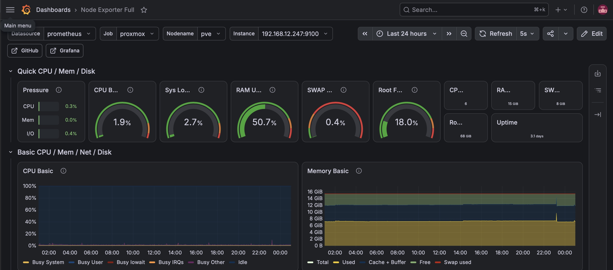

# Tearstone Homelab

A documented home lab focused on Linux, virtualization, networking, monitoring, automation, storage, and cybersecurity.

The lab is built as a practical learning environment where new technologies are deployed, tested, measured, documented, and improved over time.

## Goals

* Learn by building
* Document everything
* Automate repetitive tasks
* Simulate enterprise environments
* Apply cybersecurity best practices
* Measure system performance
* Share working configurations and lessons learned

## Current Environment

### Compute

* HP EliteDesk 800 G5 Mini
* MacBook Pro 2020

### Storage

* Zyxel NAS326
* Local Toshiba NVMe storage

### Networking

* NETGEAR GS108E managed switch
* 1 Gb Ethernet

### Virtualization

* Proxmox VE
* Debian Linux
* Kali Linux

### Monitoring

* Prometheus
* Node Exporter
* Grafana

### Security

* Qualys Scanner Appliance

### Applications

* Docker
* Immich

## Documentation

| Area         | Documentation                        |
| ------------ | ------------------------------------ |
| Architecture | [Architecture](docs/architecture.md) |
| Hardware     | [Hardware](docs/hardware.md)         |
| Monitoring   | [Monitoring](docs/monitoring.md)     |
| Systems      | [Systems](systems/)                  |
| Services     | [Services](services/)                |
| Storage      | [Storage](storage/)                  |
| Applications | [Applications](applications/)        |
| Benchmarking | [Benchmarking](benchmarking/)        |
| Roadmap      | [Roadmap](roadmap.md)                |
| Changelog    | [Changelog](changelog.md)            |

## Performance Baseline

The HP EliteDesk 800 G5 serves as the initial compute node for the lab.

Performance testing has been performed against:

* CPU
* Memory
* NVMe storage

Network and NAS/NFS performance testing will be added as the lab expands.

See the [G5 Performance Baseline](benchmarking/G5-Performance.md) for detailed results and methodology.

## Current Environment

## Project Status

**Actively building, testing, measuring, and documenting.**

The lab will evolve over time as additional compute nodes, storage, networking, monitoring, automation, and security capabilities are added.
