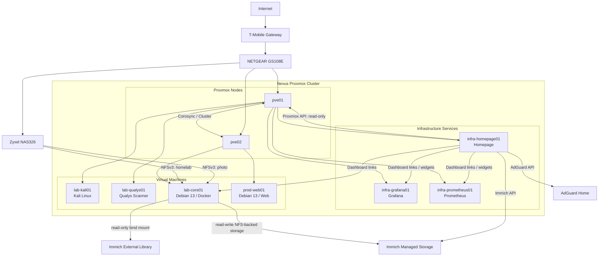
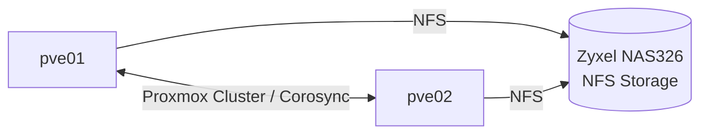
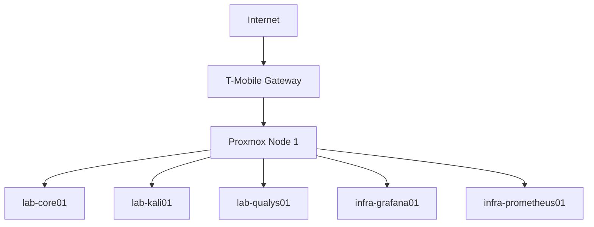

# Architecture

## Current Architecture



The homelab now consists of a two-node Proxmox VE cluster named `nexus` running on two HP EliteDesk 800 G5 Mini systems. A dedicated Debian 13 LXC, `infra-homepage01`, provides the Homepage dashboard used as the primary navigation and operational landing page for lab services.

### Proxmox Nodes

| Node | CPU | RAM | Local Storage |
| ---- | --- | --- | ------------- |
| `pve01` | Intel Core i5-9500T, 6C/6T | 32 GB | 256 GB NVMe |
| `pve02` | Intel Core i5-9500, 6C/6T | 32 GB | 256 GB NVMe + 1 TB NVMe |

Both nodes run Proxmox VE 9.2.2 and are currently quorate members of the `nexus` cluster.

The nodes are intentionally compact and low-power compared with traditional enterprise servers. The first node uses the 35 W-class i5-9500T, while the second uses the standard i5-9500 to provide an opportunity to compare performance and power characteristics.

`pve02` was installed with a deliberately lean root allocation and approximately 197 GB of local LVM-thin data storage. A second 1 TB SanDisk Optimus 5100 NVMe was subsequently added and exposed to Proxmox as the `nvme-lvm` storage tier.

`pve02` was upgraded to 32 GB using 2 × 16 GB DDR4 SODIMMs. The modules are rated for 3200 MT/s, while the Intel platform configures them at 2667 MT/s. The post-upgrade memory results are recorded below as the current host baseline.

The Zyxel NAS326 provides network storage using NFS. The NAS remains an important shared storage tier for application data, backups, and Immich media.

### Workload Placement

`lab-core01` is a dedicated Docker application host and currently runs Immich and other home lab application workloads. It was migrated from `pve01` to `pve02` following a controlled workload placement benchmark. Its 80 GB system disk now resides on the `nvme-lvm` storage tier on `pve02`.

`prod-web01` is a Debian 13 VM used for self-hosted web applications and related Cloudflare Tunnel workloads.

The existing NAS photo collection is presented to Immich as a read-only External Library. Immich managed storage is also hosted on the NAS, while Immich thumbnails and PostgreSQL remain on local NVMe storage to preserve low-latency application performance.

Prometheus collects metrics from the Linux systems using Node Exporter, while Grafana provides visualization of the collected metrics.

### Homepage Dashboard

`infra-homepage01` is a dedicated Debian 13 LXC providing the Homepage application. Homepage is installed natively on the LXC rather than through Docker or another nested container runtime.

The current software stack is:

```text
Debian GNU/Linux 13
Node.js 22.23.2
npm 10.9.8
pnpm 10.34.5
Homepage 2.1.2
```

The LXC is allocated 512 MB RAM and 512 MB swap. A temporary increase to 1 GB RAM was required to complete the Next.js production build; the allocation was reduced to 512 MB after installation and validation. The build required `NODE_OPTIONS="--max-old-space-size=768"` to provide sufficient Node.js heap during compilation. The additional memory is a build-time requirement; normal Homepage operation remains at 512 MB.

Homepage is organized into Infrastructure, Monitoring, Management, and Applications groups. The current dashboard provides links to Proxmox, the Zyxel NAS, NETGEAR switch, Grafana, Prometheus, Portainer, AdGuard Home, and Immich.

The active widgets are intentionally limited to useful operational information rather than enabling every widget supported by Homepage. Current widgets provide cluster statistics from Proxmox, DNS statistics from AdGuard Home, and application statistics from Immich.

The Proxmox integration uses a dedicated read-only `homepage@pam` account and a privilege-separated API token with `PVEAuditor` access. The Proxmox widget displays cluster-wide VM and LXC counts and cluster CPU and memory utilization. Node-specific statistics can be configured separately if required.

The AdGuard integration uses the `/control/stats` API and HTTP Basic Authentication. The Immich integration uses a dedicated API key restricted to server statistics.

API secrets are supplied through Homepage environment variables. The local `.env` file is excluded from Git and is not part of the public documentation repository. A sanitized example configuration is maintained at `docs/homepage-services.yaml.example` with private host addresses and credentials replaced by placeholders.

### Homepage Service

Homepage runs as a native systemd service on `infra-homepage01`:

```ini
[Service]
Type=simple
User=root
WorkingDirectory=/opt/homepage/homepage
Environment=NODE_ENV=production
Environment=HOMEPAGE_ALLOWED_HOSTS=<HOMEPAGE_HOST>:3000
ExecStart=/usr/bin/pnpm start
Restart=on-failure
RestartSec=5
```

The application is started with `pnpm start` after the production build has completed. The dashboard is accessed on TCP port 3000.

## Cluster

The Proxmox environment is organized as the `nexus` cluster.



The cluster currently provides two-node membership and quorum. It is being used to establish a foundation for workload migration, node comparison, storage planning, monitoring, and future high-availability experimentation.

## Workload Placement Testing

`lab-core01` was the first controlled workload-placement experiment.

The comparison was:

```text
lab-core01 on pve01
        vs.
lab-core01 on pve02
```

The VM was configured with 4 vCPUs, 12 GB RAM, and an 80 GB virtual disk using `virtio-scsi-single` with I/O thread enabled. The same sysbench CPU and memory tests and fio 4K random I/O tests were run on both hosts. The final storage tests cleared guest filesystem caches before each run.

| Test | `pve01` | `pve02` | Improvement |
| ---- | ----: | -----: | ----------: |
| CPU 1T | 1,120.76 events/s | 1,436.78 events/s | +28.2% |
| CPU 4T | 4,427.28 events/s | 5,559.86 events/s | +25.6% |
| Memory read | 23,835.9 MiB/s | 29,181.1 MiB/s | +22.4% |
| Memory write | 20,334.1 MiB/s | 25,108.7 MiB/s | +23.5% |
| 4K random read | 232K IOPS | 300K IOPS | +29.3% |
| 4K random write | 222K IOPS | 286K IOPS | +29.0% |

The preliminary cached pve02 storage result of approximately 462K read IOPS and 455K write IOPS was discarded from the official comparison. The controlled cache-cleared results above are the authoritative measurements.

The benchmark showed a consistent performance advantage for `pve02` across CPU, memory bandwidth, and random storage I/O. `lab-core01` was subsequently migrated to `pve02` and is now the preferred placement for that workload.

Power consumption was not measured because a suitable power meter was not available. Power efficiency remains a future measurement rather than an assumption.

## PVE02 Hardware Benchmarks

### Memory Benchmark

Following the installation of 2 × 16 GB DDR4 SODIMMs, `pve02` reports 31 GiB usable memory from the 32 GB installed capacity. The modules are rated for 3200 MT/s, but the platform configures them at 2667 MT/s.

The baseline memory benchmark used `sysbench memory` with a 1 MiB block size. Single-thread tests transferred 10 GiB, while four-thread tests transferred 20 GiB.

| Test | Result |
| ---- | -----: |
| 1 thread read | 29,996 MiB/s |
| 1 thread write | 25,694 MiB/s |
| 4 thread read | 112,454 MiB/s |
| 4 thread write | 85,633 MiB/s |

These results are the post-upgrade `pve02` memory baseline and should be used for future hardware or configuration comparisons.

### NVMe Storage Benchmark

The 1 TB SanDisk Optimus 5100 NVMe is presented to Proxmox as the `nvme-lvm` storage tier backed by the `pve-fast` LVM volume group. The storage pool provides approximately 931 GB of usable LVM-thin capacity.

A temporary 4 GB thin-provisioned logical volume was created for testing. The test used `fio` with 4 KiB random I/O, queue depth 32, direct I/O, a single worker, and a 60 second time-based run. The final controlled benchmark was performed with the workload VMs stopped to minimize guest I/O interference.

| Test | Result |
| ---- | -----: |
| 4K random read | **296K IOPS / 1,157 MiB/s** |
| 4K random write | **156K IOPS / 610 MiB/s** |

The read test averaged approximately 108 microseconds total latency, with the 99th percentile at approximately 135 microseconds. The write test averaged approximately 205 microseconds total latency, with the 99th percentile at approximately 273 microseconds. Higher percentile write latency was substantially more variable, reaching approximately 5.5 ms at the 99.99th percentile.

An earlier run was performed while the two VMs were still running and produced approximately 303K read IOPS / 1,182 MiB/s and 161K write IOPS / 627 MiB/s. Those results were retained as an observation but are not considered the controlled baseline because guest workloads were active. The subsequent VM-stopped results above are the authoritative `nvme-lvm` benchmark.

The temporary fio test volume was removed after testing. No test data remains on the `nvme-lvm` storage tier.

### lab-core01 Memory Observation

After migration, Proxmox reported the VM at approximately 3.5 GiB of active memory with approximately 9.56 GiB of host memory reported as available to the guest. Inside Debian, `free -h` showed approximately 2.0 GiB used, 9.5 GiB free, and 9.6 GiB available, with approximately 437 MiB of swap in use.

QEMU reported:

```text
actual=12288 MiB
max_mem=12288 MiB
total_mem=11900 MiB
free_mem=9664 MiB
```

The VM therefore retains its full 12 GB allocation. The observed reduction in the Proxmox memory usage graph is not caused by ballooning reclaiming RAM; the QEMU balloon statistics show the VM still has the full 12 GB assigned. The current workload has a small active working set and substantial available memory.

## Initial Layout

The original homelab layout



## Public Documentation Policy

This public repository intentionally omits private IP addresses, MAC addresses, serial numbers, internal DNS names, credentials, API token secrets, and other unnecessary infrastructure identifiers. Architecture, service relationships, storage paths, and benchmark results are retained because they are useful without exposing the lab's actual addressing scheme. Homepage configuration examples use placeholders for private host addresses and environment variables for secrets.
