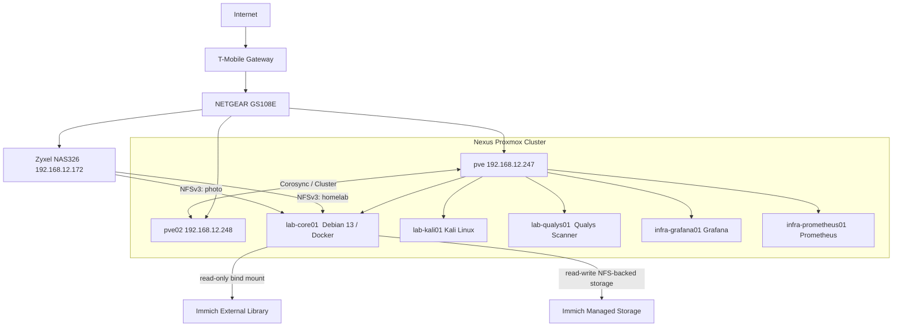
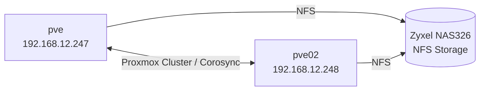
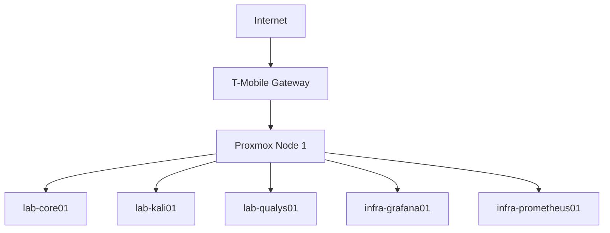

# Architecture

## Current Architecture



The homelab now consists of a two-node Proxmox VE cluster named `nexus` running on two HP EliteDesk 800 G5 Mini systems.

### Proxmox Nodes

| Node | IP Address | CPU | RAM | Local Storage |
| ---- | ---------- | --- | --- | ------------- |
| `pve` | 192.168.12.247 | Intel Core i5-9500T, 6C/6T | 16 GB | 256 GB NVMe |
| `pve02` | 192.168.12.248 | Intel Core i5-9500, 6C/6T | 16 GB | 256 GB NVMe |

Both nodes run Proxmox VE 9.2.2 and are currently quorate members of the `nexus` cluster.

The nodes are intentionally compact and low-power compared with traditional enterprise servers. The first node uses the 35 W-class i5-9500T, while the second uses the standard i5-9500 to provide an opportunity to compare performance and power characteristics.

`pve02` was installed with a deliberately lean root allocation and approximately 197 GB of local LVM-thin data storage. The first node's future storage expansion is planned around a 1 TB NVMe upgrade; that drive has not yet been purchased or installed.

The Zyxel NAS326 provides network storage using NFS. Shared storage architecture will be finalized as the local NVMe capacity of both Proxmox nodes evolves.

`lab-core01` is a dedicated Docker application host and currently runs Immich and other home lab application workloads. The VM is currently hosted on `pve`; performance and power benchmarks will later evaluate whether `pve02` is a better placement for this workload.

The Zyxel NAS326 provides an NFS export named `homelab`, currently available to `lab-core01`. A second NFS export provides the existing NAS `photo` directory to `lab-core01` for Immich.

Immich runs as a Docker Compose application on `lab-core01`. Its PostgreSQL, Redis/Valkey, and Machine Learning dependencies are containerized alongside the Immich server.

The existing NAS photo collection is presented to Immich as a read-only External Library at `/mnt/photo-library`. This preserves the existing NAS filesystem and SMB access for the established photo collection.

Immich managed storage is also hosted on the NAS under `/i-data/cfb9d897/photo/Immich`, mounted on `lab-core01` at `/mnt/immich-photo`. Phone uploads, Immich originals, encoded video, backups, and profile data are stored on the NAS. Immich thumbnails remain on the local NVMe storage at `/opt/immich/library/thumbs` to minimize latency during web and mobile photo browsing. PostgreSQL remains on the local NVMe storage as well.

The Immich managed library uses the default Storage Template:

```text
{{y}}/{{y}}-{{MM}}-{{dd}}/{{filename}}
```

Managed uploads therefore use a human-readable year/date hierarchy, while the existing external photo collection remains independent and is not reorganized by Immich.

Prometheus collects metrics from the Linux systems using Node Exporter, while Grafana provides visualization of the collected metrics.

## Cluster

The Proxmox environment is organized as the `nexus` cluster.



The cluster currently provides two-node membership and quorum. It is being used to establish a foundation for workload migration, node comparison, storage planning, and future high-availability experimentation.

## Workload Placement Testing

`lab-core01` is the primary candidate for the first controlled workload-placement experiment.

The planned comparison is:

```text
lab-core01 on pve
        vs.
lab-core01 on pve02
```

The comparison will measure CPU, memory, storage, network, application responsiveness, and system power consumption where practical. The goal is to determine whether the standard i5-9500 in `pve02` provides a meaningful performance advantage over the i5-9500T in `pve` while retaining the low-power characteristics desired for a continuously running homelab.

## Initial Layout

The original homelab layout


