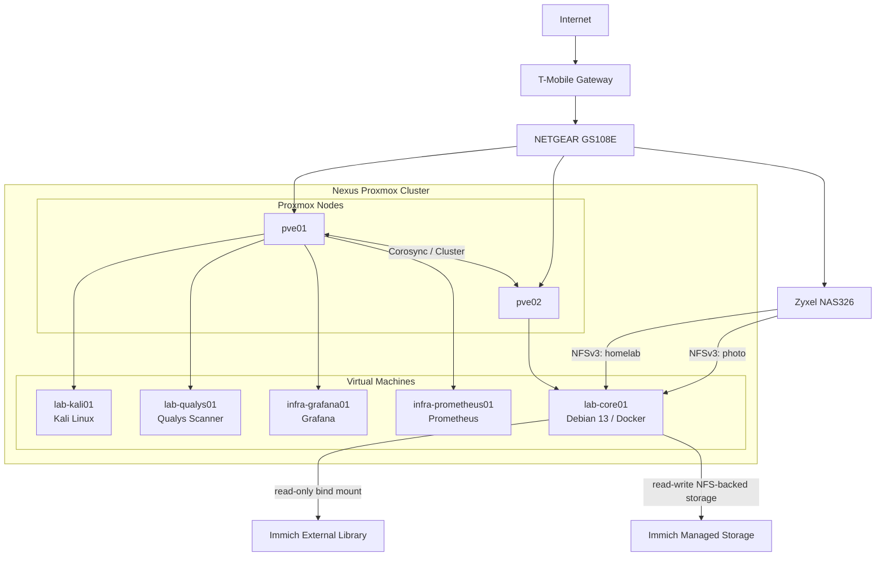
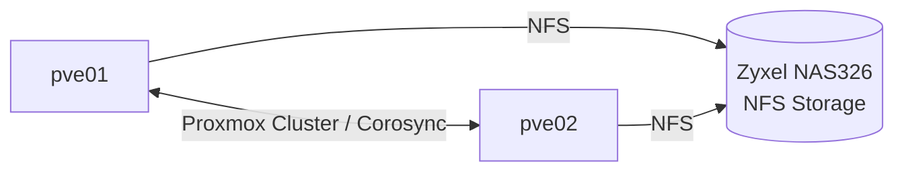
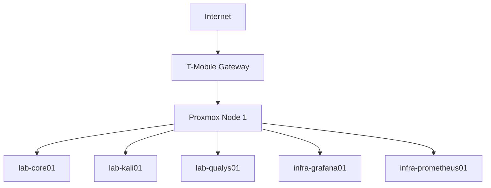

# Architecture

## Current Architecture



The homelab now consists of a two-node Proxmox VE cluster named `nexus` running on two HP EliteDesk 800 G5 Mini systems.

### Proxmox Nodes

| Node | CPU | RAM | Local Storage |
| ---- | --- | --- | ------------- |
| `pve01` | Intel Core i5-9500T, 6C/6T | 16 GB | 256 GB NVMe |
| `pve02` | Intel Core i5-9500, 6C/6T | 16 GB | 256 GB NVMe |

Both nodes run Proxmox VE 9.2.2 and are currently quorate members of the `nexus` cluster.

The nodes are intentionally compact and low-power compared with traditional enterprise servers. The first node uses the 35 W-class i5-9500T, while the second uses the standard i5-9500 to provide an opportunity to compare performance and power characteristics.

`pve02` was installed with a deliberately lean root allocation and approximately 197 GB of local LVM-thin data storage. The first node's storage expansion is planned around a 1 TB Optimus 5001 NVMe as an additional drive; that drive has not yet been purchased or installed.

The planned RAM expansion is a second 16 GB DDR4 DIMM for `pve01`, taking it from 16 GB single-module memory to 32 GB in a dual-channel configuration. This upgrade is intended to increase node capacity rather than address an immediate memory shortage.

The Zyxel NAS326 provides network storage using NFS. Shared storage architecture will be finalized as the local NVMe capacity of both Proxmox nodes evolves.

`lab-core01` is a dedicated Docker application host and currently runs Immich and other home lab application workloads. It has been migrated from `pve01` to `pve02` following a controlled workload placement benchmark.

The Zyxel NAS326 provides an NFS export named `homelab`, currently available to `lab-core01`. A second NFS export provides the existing NAS `photo` directory to `lab-core01` for Immich.

Immich runs as a Docker Compose application on `lab-core01`. Its PostgreSQL, Redis/Valkey, and Machine Learning dependencies are containerized alongside the Immich server.

The existing NAS photo collection is presented to Immich as a read-only External Library at `/mnt/photo-library`. This preserves the existing NAS filesystem and SMB access for the established photo collection.

Immich managed storage is also hosted on the NAS, mounted on `lab-core01` at `/mnt/immich-photo`. Phone uploads, Immich originals, encoded video, backups, and profile data are stored on the NAS. Immich thumbnails remain on the local NVMe storage at `/opt/immich/library/thumbs` to minimize latency during web and mobile photo browsing. PostgreSQL remains on the local NVMe storage as well.

The Immich managed library uses a human-readable year/date hierarchy, while the existing external photo collection remains independent and is not reorganized by Immich.

Prometheus collects metrics from the Linux systems using Node Exporter, while Grafana provides visualization of the collected metrics.

## Cluster

The Proxmox environment is organized as the `nexus` cluster.



The cluster currently provides two-node membership and quorum. It is being used to establish a foundation for workload migration, node comparison, storage planning, and future high-availability experimentation.

## Workload Placement Testing

`lab-core01` was the first controlled workload-placement experiment.

The comparison was:

```text
lab-core01 on pve01
        vs.
lab-core01 on pve02
```

The VM was configured with 4 vCPUs, 12 GB RAM, and an 80 GB virtual disk using `virtio-scsi-single` with I/O thread enabled. The same sysbench CPU and memory tests and fio 4K random I/O tests were run on both hosts. The final storage tests cleared guest filesystem caches before each run.

| Test | `pve01` | `pve02` | Improvement |
| ---- | ----: | -----: | ----------: |
| CPU 1T | 1,120.76 events/s | 1,436.78 events/s | +28.2% |
| CPU 4T | 4,427.28 events/s | 5,559.86 events/s | +25.6% |
| Memory read | 23,835.9 MiB/s | 29,181.1 MiB/s | +22.4% |
| Memory write | 20,334.1 MiB/s | 25,108.7 MiB/s | +23.5% |
| 4K random read | 232K IOPS | 300K IOPS | +29.3% |
| 4K random write | 222K IOPS | 286K IOPS | +29.0% |

The preliminary cached pve02 storage result of approximately 462K read IOPS and 455K write IOPS was discarded from the official comparison. The controlled cache-cleared results above are the authoritative measurements.

The benchmark showed a consistent performance advantage for `pve02` across CPU, memory bandwidth, and random storage I/O. `lab-core01` was subsequently migrated to `pve02` and is now the preferred placement for that workload.

Power consumption was not measured because a suitable power meter was not available. Power efficiency remains a future measurement rather than an assumption.

### lab-core01 Memory Observation

After migration, Proxmox reported the VM at approximately 3.5 GiB of active memory with approximately 9.56 GiB of host memory reported as available to the guest. Inside Debian, `free -h` showed approximately 2.0 GiB used, 9.5 GiB free, and 9.6 GiB available, with approximately 437 MiB of swap in use.

QEMU reported:

```text
actual=12288 MiB
max_mem=12288 MiB
total_mem=11900 MiB
free_mem=9664 MiB
```

The VM therefore retains its full 12 GB allocation. The observed reduction in the Proxmox memory usage graph is not caused by ballooning reclaiming RAM; the QEMU balloon statistics show the VM still has the full 12 GB assigned. The current workload has a small active working set and substantial available memory.

## Initial Layout

The original homelab layout



## Public Documentation Policy

This public repository intentionally omits private IP addresses, MAC addresses, serial numbers, internal DNS names, and other unnecessary infrastructure identifiers. Architecture, service relationships, storage paths, and benchmark results are retained because they are useful without exposing the lab's actual addressing scheme.
