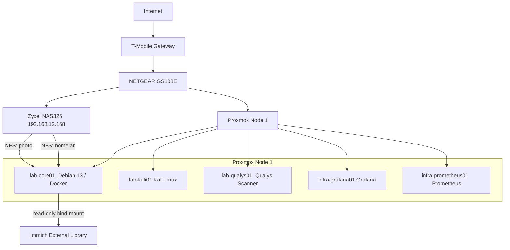
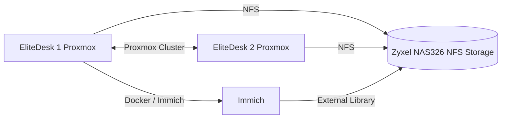
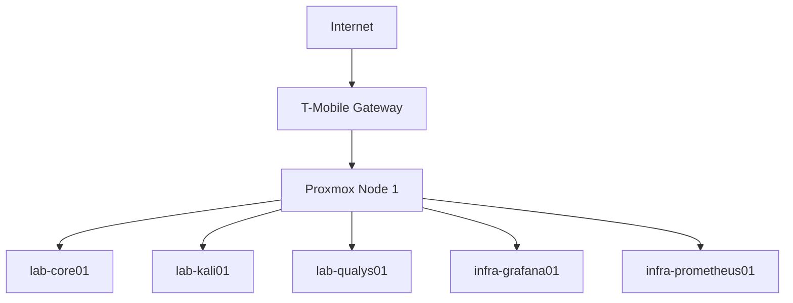

# Architecture

## Current Architecture

The current homelab consists of a Proxmox virtualization host, Linux VMs and LXCs. `lab-core01` is a dedicated Docker application host, and a Zyxel NAS326 provides network storage using HDD.

The Zyxel NAS326 provides an NFS share named `homelab`, currently restricted to `lab-core01`. A second NFS export provides the existing NAS `photo` directory to `lab-core01` for Immich.

Immich runs as a Docker Compose application on `lab-core01`. Its PostgreSQL and Redis dependencies are containerized alongside the Immich server. The existing NAS photo collection is presented to Immich as a read-only External Library, preserving the NAS filesystem and existing SMB access for other users.

Prometheus collects metrics from the Linux systems using Node Exporter, while Grafana provides visualization of the collected metrics.

## Proposed Cluster

In the not-to-distant future, we'll add a second HP EliteDesk node to the Proxmox environment and establish a small two-node cluster.

The second node will provide additional compute capacity and allow experimentation with Proxmox clustering, migration, and high availability concepts.

The NAS will provide shared storage accessible to both Proxmox nodes.

## Initial Layout

The original homelab layout

