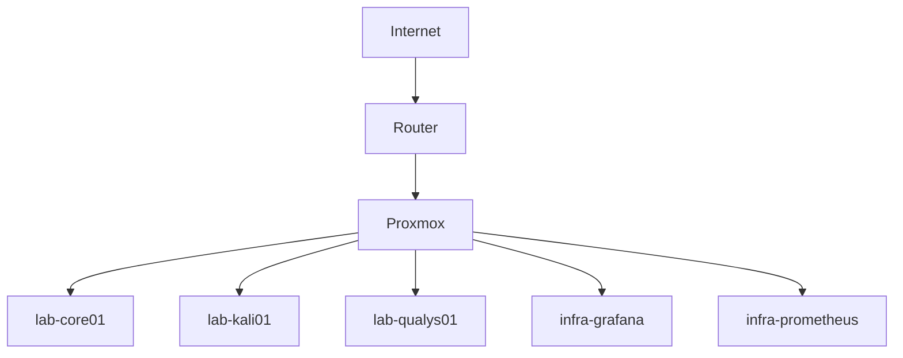
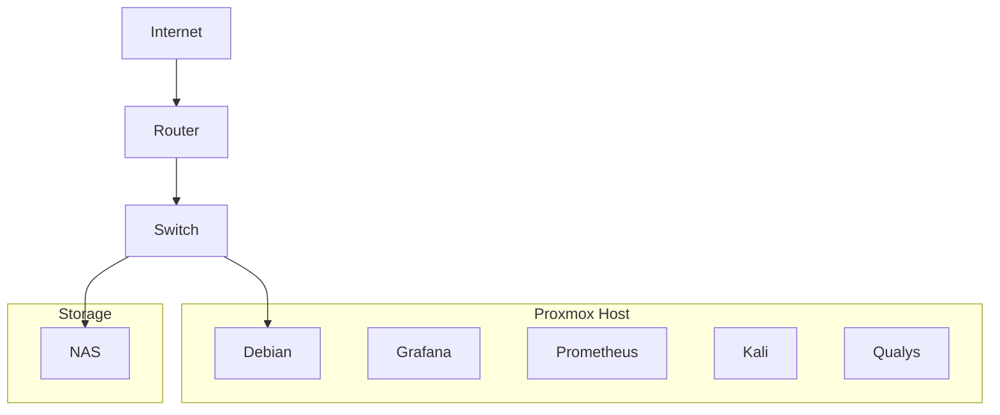
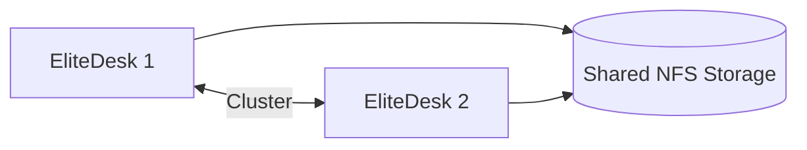

```mermaid
graph TD
    Internet --> Router

    Router --> Proxmox

    Proxmox --> lab-core01
    Proxmox --> lab-kali01
    Proxmox --> lab-qualys01
    Proxmox --> infra-grafana
    Proxmox --> infra-prometheus
```

## Next phase with Switch and NAS Added

```mermaid
graph TD

Internet --> Router
Router --> Switch

subgraph "Proxmox Host"
    Debian
    Grafana
    Prometheus
    Kali
    Qualys
end

subgraph "Storage"
    NAS
end

Switch --> Debian
Switch --> NAS
```

## Proposed Cluster (Second Node) 

```mermaid
graph LR

NAS[(Shared NFS Storage)]

Node1[EliteDesk 1]
Node2[EliteDesk 2]

Node1 <-- Cluster --> Node2

Node1 --> NAS
Node2 --> NAS
```

