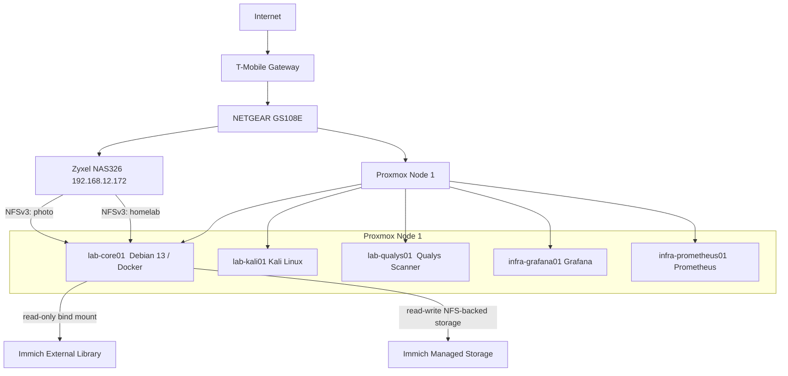
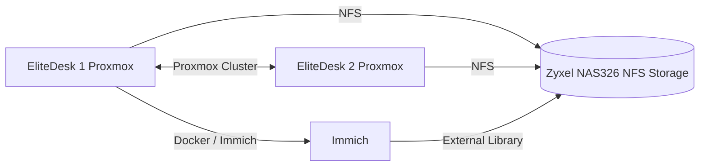
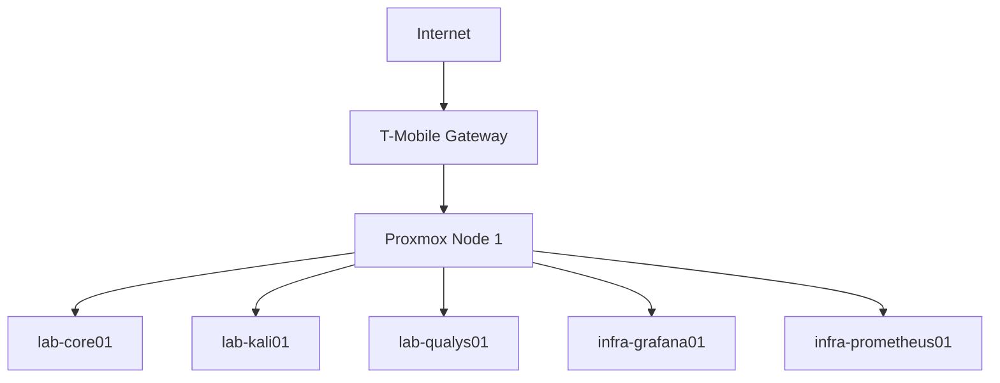

# Architecture

## Current Architecture



The current homelab consists of a Proxmox virtualization host, Linux VMs and LXCs. `lab-core01` is a dedicated Docker application host, and a Zyxel NAS326 provides network storage using HDD.

The Zyxel NAS326 provides an NFS export named `homelab`, currently available to `lab-core01`. A second NFS export provides the existing NAS `photo` directory to `lab-core01` for Immich.

Immich runs as a Docker Compose application on `lab-core01`. Its PostgreSQL, Redis/Valkey, and Machine Learning dependencies are containerized alongside the Immich server.

The existing NAS photo collection is presented to Immich as a read-only External Library at `/mnt/photo-library`. This preserves the existing NAS filesystem and SMB access for the established photo collection.

Immich managed storage is also hosted on the NAS under `/i-data/cfb9d897/photo/Immich`, mounted on `lab-core01` at `/mnt/immich-photo`. Phone uploads, Immich originals, encoded video, backups, and profile data are stored on the NAS. Immich thumbnails remain on the local NVMe storage at `/opt/immich/library/thumbs` to minimize latency during web and mobile photo browsing. PostgreSQL remains on the local NVMe storage as well.

The Immich managed library uses the default Storage Template:

```text
{{y}}/{{y}}-{{MM}}-{{dd}}/{{filename}}
```

Managed uploads therefore use a human-readable year/date hierarchy, while the existing external photo collection remains independent and is not reorganized by Immich.

Prometheus collects metrics from the Linux systems using Node Exporter, while Grafana provides visualization of the collected metrics.


## Proposed Cluster

In the not-to-distant future, we'll add a second HP EliteDesk node to the Proxmox environment and establish a small two-node cluster.



The second node will provide additional compute capacity and allow experimentation with Proxmox clustering, migration, and high availability concepts.

The NAS will provide shared storage accessible to both Proxmox nodes.

## Initial Layout

The original homelab layout


