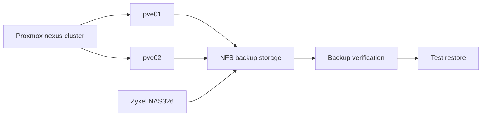

# Backup and Recovery

## Project Objective

Establish a reliable backup and recovery capability for the `nexus` Proxmox cluster using the existing Zyxel NAS326 NFS storage, with documented retention, verification, and restore procedures.

The goal is not simply to create backup files. The goal is to demonstrate that critical workloads can be recovered from those backups.

## Current State

The lab already has:

* Two Proxmox nodes in the `nexus` cluster.
* Shared NFS storage provided by the Zyxel NAS326.
* Proxmox backup storage configured on the NAS.
* Multiple VMs and LXCs that represent the current production and infrastructure workloads.
* Existing monitoring through Prometheus, Grafana, and Uptime Kuma.

The backup project will formalize and validate this capability rather than introduce another storage platform immediately.

## Backup Scope

The initial backup set should include workloads that would require recovery after a Proxmox node failure, storage failure, accidental deletion, or configuration error.

Priority should be based on recoverability and business impact rather than simply backing up every guest equally.

### Initial Priority

1. `lab-core01`
2. `prod-web01`
3. `infra-homepage01`
4. `infra-uptime01`
5. Other noncritical lab VMs and LXCs

The exact backup inventory will be confirmed during implementation.

## Backup Architecture

The initial design uses the NAS as the backup target because it already provides shared NFS storage and avoids adding unnecessary infrastructure before the recovery process itself is proven.

## Project Phases

### Phase 1 — Inventory

* Identify all VMs and LXCs requiring protection.
* Classify workloads as critical, important, or disposable.
* Identify application specific data that is not contained in the guest backup.
* Establish recovery priorities.

### Phase 2 — Automated Backups

* Configure scheduled Proxmox backup jobs.
* Store backups on the existing NAS backed storage.
* Select an initial retention policy appropriate for the NAS capacity.
* Confirm backup jobs execute from the intended Proxmox node or cluster configuration.

### Phase 3 — Verification

* Confirm successful completion of backup jobs.
* Inspect backup archives and metadata.
* Confirm Proxmox can enumerate the resulting backup files.
* Monitor backup job failures through the existing monitoring stack where practical.

### Phase 4 — Recovery Testing

* Restore at least one representative VM or LXC to a nonproduction test target.
* Verify the restored guest boots successfully.
* Verify network connectivity and expected services.
* For application workloads, verify the application and persistent data.
* Record the recovery procedure and observed recovery time.

### Phase 5 — Documentation

* Document the backup schedule.
* Document retention policy.
* Document backup storage architecture.
* Document restore procedures.
* Define recovery priorities.
* Record recovery time observations.
* Identify gaps requiring future work.

### Phase 6 — Future Resilience

After local backup and restore procedures are proven, evaluate:

* Offsite backup copies.
* Backup encryption.
* Longer term retention.
* Automated recovery testing.
* Disaster recovery procedures for total NAS loss.

## Recovery Objectives

Initial targets will be established during the project rather than assumed in advance.

The project should document:

* **RPO:** How much recent data the lab can afford to lose.
* **RTO:** How long recovery of a critical workload should take.

These values should reflect the actual lab's requirements and the capabilities of the backup architecture.

## Security Considerations

* Backup storage should not be unnecessarily exposed to the user network.
* Backup access should use dedicated permissions where supported.
* Credentials and secrets must never be stored in this public repository.
* Public documentation must omit private IP addresses, MAC addresses, and other unnecessary internal identifiers.
* Offsite copies should be considered if the NAS becomes a single point of failure.

## Success Criteria

The project is complete when:

* Critical workloads are covered by scheduled backups.
* Retention is defined and verified.
* Backup jobs have been observed completing successfully.
* At least one backup has been restored successfully.
* Recovery steps are documented well enough to repeat the procedure without guesswork.
* RPO and RTO targets are documented.
* Remaining resilience gaps are identified as future work.

## Current Status

**Project initiated.** Backup automation, verification, and recovery testing remain in progress.

## Public Documentation Policy

This document describes backup architecture, process, and recovery objectives without publishing private network addresses, credentials, or other sensitive operational details.
