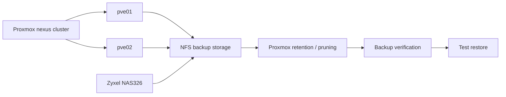

# Backup and Recovery

## Project Objective

Establish a reliable backup and recovery capability for the `nexus` Proxmox cluster using the existing Zyxel NAS326 NFS storage, with documented retention, verification, and restore procedures.

The goal is not simply to create backup files. The goal is to demonstrate that critical workloads can be recovered from those backups.

## Implemented Backup Configuration

The current Proxmox backup job is configured at the cluster level with:

* **Schedule:** Daily at 02:00
* **Target:** `nas-backup` NFS storage on the Zyxel NAS326
* **Mode:** Snapshot
* **Compression:** ZSTD
* **Retention:** Keep last 3, keep weekly 1, keep monthly 1
* **Selection:** Seven protected VMs/LXCs listed below

The backup job is enabled and uses Proxmox `vzdump` scheduling. Retention is implemented through Proxmox `prune-backups` rules.

## Protected Workloads

The current automated backup scope is:

| VMID | Workload | Type | Protection |
| ---: | --- | --- | --- |
| 100 | `lab-core01` | VM | Automated |
| 103 | `prod-web01` | VM | Automated |
| 200 | `infra-prometheus01` | LXC | Automated |
| 201 | `infra-grafana01` | LXC | Automated |
| 202 | `infra-dns01` | LXC | Automated |
| 203 | `infra-homepage01` | LXC | Automated |
| 204 | `infra-uptime01` | LXC | Automated |

The following workloads are intentionally excluded:

* VM 101 `lab-qualys01` — disposable scanner appliance with no persistent data that currently requires recovery.
* VM 102 `lab-kali01` — intentionally excluded from the automated backup scope for now.

The backup scope may be revised as workload criticality and recovery requirements evolve.

## Backup Architecture



The NAS is the initial backup target because it already provides shared NFS storage. This avoids introducing another backup platform before the local backup and recovery process is proven.

## Backup Execution and Verification

Automated backups were observed completing successfully on consecutive scheduled runs. The September 9, 2026 run completed all seven selected workloads successfully.

Proxmox also recorded the active pruning policy in the scheduled `vzdump` invocation:

```text
--prune-backups 'keep-last=3,keep-monthly=1,keep-weekly=1'
```

The resulting backup inventory demonstrated that retention rules were being applied. Recovery points from the most recent three runs were retained, with older weekly and monthly recovery points retained where they satisfied those rules.

The NAS backup directory contained 31 actual compressed backup archives at the time of verification, along with associated Proxmox log and notes files. The directory contained 31 `.zst` archives, 31 `.log` files, and 30 `.notes` files.

## Recovery Verification

A real recovery test was performed using the September 8, 2026 backup of `infra-dns01` (VMID 202).

The backup was restored to a temporary LXC, VMID 220, on the Proxmox host using local LVM-thin storage. The restored container was intentionally kept isolated from the production network before it was started to prevent duplicate hostname/IP identity and accidental DNS service conflicts.

### Restore Validation

The restored container was verified to contain:

* A complete Debian filesystem.
* The original `infra-dns01` hostname.
* The AdGuard Home executable and systemd service.
* The restored `AdGuardHome.yaml` configuration.
* AdGuard Home persistent data, including query log, statistics database, filter data, and session database.
* Normal base system services including SSH and systemd-managed services.

AdGuard Home reached application initialization during the test. Its subsequent failure was expected because the restored container had no network interface and the preserved configuration attempted to bind the application to its production address. The service journal reported `cannot assign requested address` when binding the Web/API listener.

This failure was an intentional consequence of network isolation, not evidence of a damaged backup. The restored application binary, configuration, and persistent data were present and readable.

After verification, the temporary VMID 220 container was stopped and destroyed. The production `infra-dns01` container remained untouched.

### Recovery Test Result

**Restore verification: successful.**

The test demonstrates that a Proxmox backup can be restored into a new guest and that the guest filesystem, application installation, configuration, and application state are recoverable. A production-network application failover was intentionally not attempted because doing so would have created a duplicate service identity.

## Retention Policy

The implemented retention policy is:

| Rule | Value | Purpose |
| --- | ---: | --- |
| Keep last | 3 | Maintain several recent recovery points |
| Keep weekly | 1 | Preserve an older weekly recovery point |
| Keep monthly | 1 | Preserve an older monthly recovery point |

Retention rules can overlap, so the actual number of retained archives is not necessarily five per workload. Calendar-based weekly and monthly rules may preserve recovery points that are older than the three most recent backups.

## Recovery Procedure

The general recovery procedure is:

1. Identify the required VM or LXC and the appropriate backup recovery point.
2. Confirm the backup archive is available on `nas-backup`.
3. Restore the guest to the intended Proxmox node and storage.
4. If restoring alongside the original guest, assign a temporary VMID and isolate or modify networking before starting it.
5. Start the restored guest only after duplicate network identity risks have been addressed.
6. Verify the guest operating system and expected application services.
7. Verify application configuration and persistent data.
8. Restore normal networking and production identity only when the original workload has been stopped or otherwise safely removed from service.
9. Record the recovery result and any changes required to improve the procedure.

The restore test demonstrated why network identity must be considered when recovering infrastructure services such as DNS.

## Recovery Objectives

The current architecture provides a nightly backup cadence, so the operational recovery point is generally bounded by the most recent successful scheduled backup. Exact application-level RPO depends on when the application's data was last written and captured by the guest backup.

RTO has not been established as a formal target. The completed restore test demonstrates that recovery is practical, but additional timed recovery exercises are required before committing to a specific RTO.

## Security Considerations

* Backup storage should not be unnecessarily exposed to the user network.
* Backup access should use dedicated permissions where supported.
* Credentials and secrets must never be stored in this public repository.
* Public documentation must omit private IP addresses, MAC addresses, and other unnecessary internal identifiers.
* Restored infrastructure services must be isolated from production until duplicate identity and networking risks are addressed.
* The NAS remains a local backup target and therefore a single-site failure domain.

## Current Resilience Gaps and Future Work

The local backup and restore workflow is now proven, but it is not yet a complete disaster-recovery architecture.

Future work includes:

* Offsite backup copies.
* Evaluation of backup encryption.
* Longer-term retention if required.
* Timed recovery exercises to establish realistic RTO values.
* Automated or periodic restore verification.
* Disaster recovery procedures for total NAS loss.
* Evaluation of Proxmox Backup Server when the lab's scale or recovery requirements justify a dedicated backup platform.

## Success Criteria

The project objectives are now met for the initial local backup implementation:

* Critical workloads are covered by scheduled backups.
* Retention is defined and verified through an actual pruning cycle.
* Backup jobs have been observed completing successfully.
* A representative LXC backup has been restored successfully.
* The restored application's configuration and persistent state were verified.
* Recovery steps and network-isolation considerations are documented.
* Remaining resilience gaps are identified as future work.

## Current Status

**Initial Proxmox backup and recovery implementation complete.** Automated backups, retention, backup verification, and a representative restore test have been successfully implemented and validated.

## Public Documentation Policy

This document describes backup architecture, process, and recovery objectives without publishing private network addresses, credentials, or other sensitive operational details.
