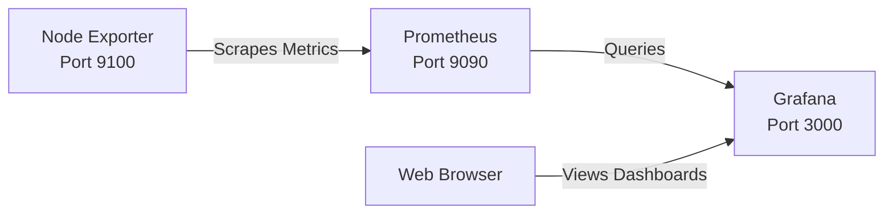

# Monitoring

Monitoring provides visibility into the health and performance of the home lab. The current stack is based on Prometheus for metrics collection and Grafana for visualization. Additional components will be added as the lab grows.

---

## Architecture

---

## Monitoring Stack

| Component | Purpose | Default Port | Status |
|-----------|---------|:------------:|:------:|
| Prometheus | Collects and stores metrics from monitored systems | 9090 | ✅ Running |
| Node Exporter | Exposes Linux system metrics | 9100 | ✅ Running |
| Grafana | Visualizes metrics and dashboards | 3000 | ✅ Running |
| Alertmanager | Sends alerts based on Prometheus rules | 9093 | 📅 Future |
| Blackbox Exporter | Monitors network services and endpoint availability | 9115 | 📅 Future |

---

## Current Capabilities

Currently monitoring:

- CPU utilization
- Memory utilization
- Disk usage
- Filesystem capacity
- Network throughput
- System uptime
- Load average

---

## Planned Capabilities

- Email alerts
- SSL certificate expiration
- HTTP endpoint monitoring
- DNS monitoring
- NAS health
- Proxmox cluster metrics
- Docker container monitoring

---

## Data Flow

1. Node Exporter exposes Linux metrics on port **9100**.
2. Prometheus scrapes those metrics at regular intervals.
3. Prometheus stores the metrics in its time series database.
4. Grafana queries Prometheus.
5. Dashboards display real time and historical performance.

---

## Why This Stack?

After evaluating several monitoring solutions, I selected the Prometheus ecosystem because it is:

- Open source
- Highly extensible
- Well integrated with Grafana
- Commonly used in enterprise environments

---

## Lessons Learned

- Prometheus is much easier to configure than expected.
- Node Exporter installs directly from the Debian repositories.
- Verifying metrics locally before configuring Prometheus greatly simplifies troubleshooting.
