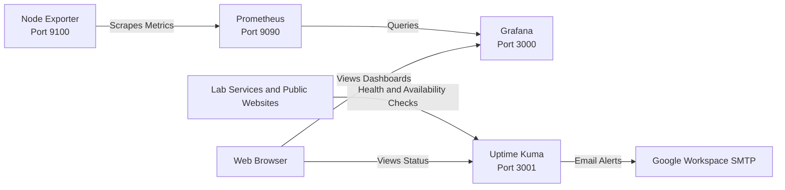

# Monitoring

Monitoring provides visibility into the health, availability, and performance of the home lab. The current stack uses Prometheus and Grafana for metrics collection and visualization, with Uptime Kuma providing service availability monitoring and email alerting.

---

## Architecture

---

## Monitoring Stack

| Component | Purpose | Default Port | Status |
|-----------|---------|:------------:|:------:|
| Prometheus | Collects and stores metrics from monitored systems | 9090 | ✅ Running |
| Node Exporter | Exposes Linux system metrics | 9100 | ✅ Running |
| Grafana | Visualizes metrics and dashboards | 3000 | ✅ Running |
| Uptime Kuma | Monitors service availability and sends notifications | 3001 | ✅ Running |
| Alertmanager | Sends alerts based on Prometheus rules | 9093 | 📅 Future |
| Blackbox Exporter | Monitors network services and endpoint availability for Prometheus | 9115 | 📅 Future |

---

## Monitoring Roles

The monitoring stack is intentionally divided by function:

### Prometheus and Grafana

Prometheus collects time series metrics from infrastructure and services. Grafana provides dashboards for performance and resource utilization.

Current metrics include:

* CPU utilization
* Memory utilization
* Disk usage
* Filesystem capacity
* Network throughput
* System uptime
* Load average

### Uptime Kuma

Uptime Kuma provides availability monitoring and notification for infrastructure, internal services, and public websites.

Uptime Kuma is hosted on the dedicated `infra-uptime01` Debian 13 LXC and runs directly on the operating system rather than inside Docker.

The initial deployment uses:

* Uptime Kuma 2.0.0
* Node.js 22.23.2 LTS
* SQLite
* 10 minute monitoring intervals
* Two retries before a monitor is considered down
* Google Workspace SMTP for email notifications

The configuration is intentionally sized for a home lab rather than a production incident response environment.

## Uptime Kuma Monitoring Strategy

### Infrastructure

ICMP Ping monitors are used for infrastructure systems such as the Proxmox nodes.

The `infra-uptime01` LXC remains unprivileged. Debian's `iputils-ping` executable did not have the required raw socket capability in the container, so `cap_net_raw` was assigned to `/usr/bin/ping`. ICMP monitoring was then verified successfully using the non-root `uptime-kuma` service account.

### Internal Services

HTTP(s) monitors are used for application services. Dedicated health endpoints are preferred where available.

Prometheus is monitored using its `/-/healthy` endpoint rather than only checking port 9090. Portainer is monitored over HTTPS with TLS validation disabled for that monitor because the internal Portainer endpoint uses a self-signed certificate.

### Public Services

The following public websites are monitored using their public HTTPS endpoints:

* `tearstone.com`
* `rvtravelbug.com`
* `rsanderlin.com`

Public TLS certificate validation remains enabled for these monitors.

## Notifications

Uptime Kuma sends email notifications through Google Workspace SMTP using TLS/STARTTLS on port 587. Authentication uses an application-specific password rather than the normal Google account password.

SMTP credentials are kept out of the public repository.

## Homepage Integration

Uptime Kuma is integrated into the dedicated Homepage dashboard hosted on `infra-homepage01`.

A Uptime Kuma status page is used as the data source for the Homepage Uptime Kuma service widget. The dashboard displays aggregate monitor status in the Monitoring group.

## Data Flow

1. Node Exporter exposes Linux metrics on port **9100**.
2. Prometheus scrapes those metrics at regular intervals.
3. Prometheus stores the metrics in its time series database.
4. Grafana queries Prometheus.
5. Grafana dashboards display real time and historical performance.
6. Uptime Kuma independently checks infrastructure, application endpoints, and public HTTPS services.
7. Uptime Kuma sends email notifications when monitored services fail or recover.

---

## Why This Stack?

The Prometheus ecosystem provides flexible metrics collection and visualization, while Uptime Kuma provides a simple availability and notification layer. Keeping these responsibilities separate avoids using performance monitoring to infer application availability and gives the lab both historical metrics and actionable outage detection.

The stack is also intentionally lightweight and appropriate for a home lab environment.

## Planned Capabilities

* Prometheus alerting and Alertmanager
* Additional endpoint health monitoring
* DNS monitoring
* NAS health monitoring
* Docker container metrics
* Additional public service monitoring

## Lessons Learned

* Prometheus and Uptime Kuma serve different monitoring purposes and work well together.
* Dedicated application health endpoints provide more meaningful availability checks than checking only whether a TCP port responds.
* An unprivileged Debian LXC can support Uptime Kuma ICMP monitoring when the `ping` executable has the required `cap_net_raw` file capability.
* Internal services using self-signed certificates can be monitored over HTTPS by selectively disabling TLS validation for that monitor.
* SQLite is sufficient for the current Uptime Kuma workload.
* A 10 minute monitoring interval is appropriate for this non-critical home lab and avoids unnecessary monitoring traffic.
