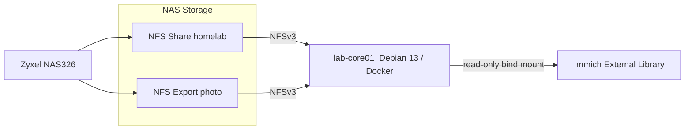

## Homelab Share

The `homelab` NFS share is hosted on the Zyxel NAS326 and is currently restricted to `lab-core01`.

NAS export:

```text
/i-data/cfb9d897/nfs/homelab
```

Client mount:

```text
NAS NFS export: homelab -> /mnt/nas
```

The mount is persistent through `/etc/fstab` and uses `_netdev` so system startup waits for the network.

## Photo Export

The existing Zyxel photo share is separately exported over NFS to `lab-core01` so Immich can index the existing collection without moving or reorganizing the underlying files.

NAS export:

```text
/i-data/cfb9d897/photo
```

Client mount:

```text
NAS NFS export: photo -> /mnt/photo-library
```

The photo export uses NFSv3.

Inside the Immich container, the directory is exposed at:

```text
/mnt/photo-library
```

The container mount is read-only. The same underlying `/photo` directory remains available through the existing SMB `photo` share, allowing other users and systems to continue accessing the collection without Immich changing its directory structure.

## Validation

The NFS photo export was validated from `lab-core01` by mounting the export directly and confirming the existing directories and files were visible. The mounted collection is approximately 384 GB and contains tens of thousands of existing photo and video assets.

Immich successfully accessed the collection through the container mount and discovered approximately 94,201 photos and 1,407 videos during the initial scan.

## Public Documentation Policy

Actual NFS client and server IP addresses are intentionally omitted from this public repository. Export names, mount points, protocol versions, and storage architecture are retained because they document the design without exposing internal addressing.
