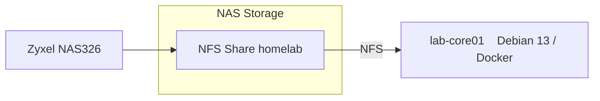

```mermaid

flowchart LR
    NAS["Zyxel NAS326  <PRIVATE_IP>"]
    
    subgraph Storage["NAS Storage"]
        NFS["NFS Share  homelab"]
    end

    CORE["lab-core01  <PRIVATE_IP>  Debian 13 / Docker"]

    NAS --> NFS
    NFS -->|NFS| CORE
```

The `homelab` NFS share is hosted on the Zyxel NAS326 and is currently restricted to `lab-core01`. The share will provide network storage for applications running on the Docker host.
